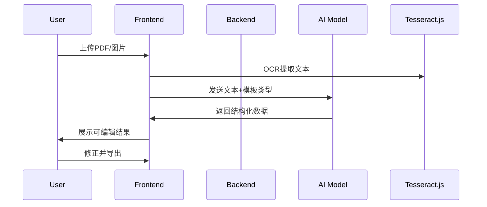

## **1. 项目背景**  
### **痛点**  
- 用户需要手动从PDF、扫描件、合同或调查问卷中提取数据（如姓名、金额、日期等），耗时且易出错。  
- 现有OCR工具（如Adobe Scan）仅提供文本转换，缺乏结构化理解和智能处理能力。  

### **解决方案**     
开发一个基于AI的Web应用，支持：  
1. **自动字段提取**：从文档中识别关键字段（如发票号、签名区域）。  
2. **智能校验**：高亮可疑数据（如金额不一致）。  
3. **一键导出**：结构化数据（JSON/CSV）供后续系统使用。  

---

## **2. 目标用户**  
| 用户类型          | 使用场景示例                          | 需求优先级 |  
|-------------------|---------------------------------------|------------|  
| 中小企业财务人员  | 批量处理扫描发票，提取金额、供应商    | P0         |  
| 法律助理          | 从合同中提取甲方乙方、关键条款        | P1         |  
| 市场调研人员      | 汇总纸质问卷结果（选择题+开放题）     | P1         |  

---

## **3. 核心功能需求**  
### **3.1 文档上传与解析（P0）**  
- **支持文件类型**：  
  - PDF（扫描件/数字版）、JPEG/PNG（手机拍摄）。  
- **解析方式**：  
  - **OCR引擎**：Tesseract.js（纯前端）或Dify插件（后端）。  
  - **文本结构化**：Hugging Face LayoutLM模型（识别表格、字段名和值的关系）。  

### **3.2 字段智能提取（P0）**  
- **预置模板库**（常见文档类型）：  
  - 发票、简历、租房合同、调查问卷。  
  - 用户可自定义模板（通过标注示例文档训练模型）。  
- **动态字段识别**：  
  - 若用户未选择模板，自动识别疑似字段（如“日期：2023-11-20”）。  

### **3.3 数据校验与编辑（P1）**  
- **校验规则**：  
  - 格式检查（日期是否符合YYYY-MM-DD）。  
  - 逻辑检查（发票总金额是否等于单项求和）。  
- **交互设计**：  
  - 高亮可疑字段，用户可手动修正。  

### **3.4 导出与集成（P0）**  
- **导出格式**：JSON、CSV、Excel。  
- **集成能力**：  
  - Webhook推送至用户指定系统（如Zapier、Google Sheets）。  

---

## **4. 技术方案**  
### **4.1 前端（Next.js）**  
- **核心库**：  
  - `react-pdf`：PDF预览。  
  - `tesseract.js`：浏览器内OCR（隐私优先）。  
  - `react-json-view`：结构化数据展示。  
- **关键页面**：  
  - `/upload`：文件上传与模板选择。  
  - `/edit`：字段校对与导出。  

### **4.2 后端（可选）**  
- **方案A：纯前端**  
  - 使用Transformers.js直接在浏览器运行轻量模型（如LayoutLM微型版）。  
  - **优点**：无服务器成本，隐私友好。  
  - **缺点**：模型精度受限。  

- **方案B：Dify + Ollama**  
  - 部署Dify服务，集成Ollama运行Mistral 7B或LayoutLMv3。  
  - **优点**：支持复杂逻辑（如合同问答）。  
  - **缺点**：需维护后端。  

### **4.3 AI模型选型**  
| 任务                | 推荐模型                          | 运行位置      |  
|---------------------|-----------------------------------|---------------|  
| OCR                 | Tesseract.js                     | 浏览器        |  
| 字段提取            | Hugging Face LayoutLMv3 (微型版)  | 浏览器/后端   |  
| 逻辑校验            | Ollama + Mistral 7B              | 后端（Dify）  |  

---

## **5. 用户流程**  

---

## **6. 非功能性需求**  
- **性能**：  
  - 单页文档处理时间 ≤5秒（浏览器内OCR）。  
- **隐私**：  
  - 默认数据不存储，用户可选本地缓存历史记录。  
- **兼容性**：  
  - 支持Chrome/Firefox/Edge最新版。  

---

## **7. 未来扩展**  
- **团队协作**：多人同时批注同一文档。  
- **自动化**：设置规则自动处理特定类型文档（如“所有发票存入Google Sheets”）。  
- **付费点**：  
  - 高级模板库、API调用额度、企业版On-Premise部署。  

---

## **8. 验收标准**  
1. MVP版本：用户上传发票图片→自动提取金额、日期→导出CSV。  
2. 进阶版本：支持自定义模板+数据校验。  

---

**附录**：  
- 竞品分析：Adobe Acrobat（贵）、Tabula（难用）。  
- 技术风险：浏览器内OCR精度可能低于后端方案。  

------------------------------
以下是按照图片中的表格格式整理的**智能文档/表单处理助手**需求文档：

---

### **智能文档处理系统技术方案**  

| **主要功能**               | **选用技术**                     | **Comments**                                                                 |
|----------------------------|----------------------------------|-----------------------------------------------------------------------------|
| **文档上传与解析**         | Tesseract.js + LayoutLMv3        | 支持PDF/图片上传，浏览器端OCR优先，复杂文档可降级至后端处理                  |
| **字段智能提取**           | Hugging Face Transformers.js     | 预置发票/合同模板，支持用户标注训练自定义字段                                |
| **数据校验与编辑**         | 规则引擎 + Mistral 7B（Ollama）  | 逻辑校验（如金额求和）使用轻量LLM，高亮异常字段                             |
| **导出与集成**             | Firebase/FastAPI                 | 导出JSON/CSV，支持Webhook推送至Zapier/Google Sheets                         |
| **前端展示**               | Next.js + React-PDF              | 响应式设计，支持移动端预览和编辑                                            |
| **数据存储**               | Supabase PostgreSQL              | 免费层支持MVP，企业版可升级至私有部署                                       |

如需调整或补充细节（如特定表单类型的字段定义）随时讨论.